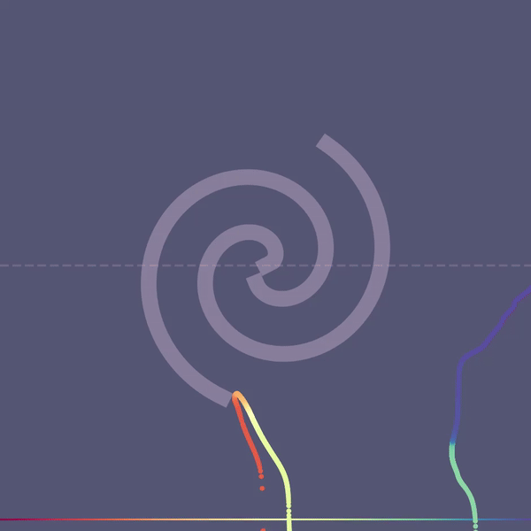

# Adversarial Defences with Manifold-Learning Flows

This repository contains the code for a course project done in the **Computational Intelligence Lab 2024** at ETH Zurich by
- **[Claire Bräuer](mailto:claireabareuer@gmail.com)**
- **[Pablo Robles Cervantes](mailto:probles@student.ethz.ch)**
- **[Yufei Liu](mailto:yufei.liu@inf.ethz.ch)**
- **[Chris Offner](mailto:chrisoffner@pm.me)**

Adversarial vulnerability remains a significant challenge for deep neural networks, as inputs manipulated with imperceptible perturbations can induce misclassification. Recent research posits that natural data occupies low-dimensional manifolds, while adversarial samples reside in the ambient space beyond these manifolds. Motivated by this _off-manifold hypothesis,_ we propose and examine a novel defense mechanism that employs **[manifold-learning normalizing flows (M-Flows)](https://arxiv.org/abs/2003.13913)** to project input samples onto approximations of the data manifold prior to classification.

We illustrate the underlying principles of our method with a low-dimensional pedagogical example before testing its effectiveness on high-dimensional natural image data. While our method shows promise in principle on low-dimensional data, learning the data manifold proves highly unstable and sensitive to initial conditions. On image data, our method fails to surpass the baseline.

Supplementary animations that elucidate some of the discussed dynamics can be found on https://chrisoffner.github.io/mflow_defence/.

---

### Jupyter notebooks

- `notebooks/two_spirals.ipynb`: Training the _Two Spirals_ classifier.
- `notebooks/attack_spiral_classifier.ipynb`: Adversarial attacks and defense of the _Two Spirals_ classifier. **Fig. 1** in the report was created here.
- `notebooks/defense_cases_frequency.ipynb`: Measuring the relative frequency of attack/defense cases **(A) - (D)** as described in **Sec. 3** of the report. **Fig. 5.** was created here.
- `notebooks/spiral_manifold_projection.ipynb`: Visualisations of the learned _on-manifold_ projection. **[Animations](https://chrisoffner.github.io/mflow_defence/)**, **Fig. 3**, and **Fig. 4** from the report were created here.
- `notebooks/attack_cifar10.ipynb`: Demo for attacking CIFAR-10 images.
    > NOTE: For automatic generation see the script `generate_attacked_cifar10py` below.

### Python scripts

- `notebooks/two_spirals_utils.py`: Generates the _Two Spirals_ dataset.
- `notebooks/generate_attacked_cifar10.py`: Generates datasets of adversarial FGSM and PGD attacks against the CIFAR-10 dataset for the specified perturbation magnitudes.  The default parameters correspond to the attacks we performed.
    

    
Requirements
 

    - Must be run inside `notebooks/`.

    - Trained ResNet-50 classifier checkpoint saved in `models/resnet/resnet50_cifar10.pt` (instructions [here](./models/resnet/README.md)).
    

- `notebooks/undefended_resnet_accuracy.py`: Measure the classification accuracy of the ResNet classifier after being attacked.
    

    
Requirements
 

    - Must be run inside `notebooks/`.

    - Trained ResNet-50 classifier checkpoint saved in `models/resnet/resnet50_cifar10.pt`.

    - Attacked datasets generated with `generate_attacked_cifar10.py`.
    

- `notebooks/pixeldefend_cases_frequency.py`: Measures the relative frequency of attack/defense cases for the _PixelDefend_ baseline on CIFAR-10. 
    

    
Requirements
 

    - Must be run inside `notebooks/`.

    - Trained ResNet-50 classifier checkpoint saved in `models/resnet/resnet50_cifar10.pt`.  

    - Attacked datasets generated with `notebooks/generate_attacked_cifar10.py`.  

    - Purified datasets with [PixelDefend](https://github.com/microsoft/PixelDefend) with a defense radius $\epsilon_\text{def} = 16$. For each attack `<attack>` and attack perturbation magnitude `<eps>`, the script expects to find the corresponding purified datasets in `data/cifar10_pixeldefend/` as a tarball named `cifar10_<attack>_atkeps_<eps>_defeps_16.tar.gz`. The tarball should contain the dataset as a single file named `cifar10_<attack>_atkeps_<eps>_defeps_16.pt`.
    
